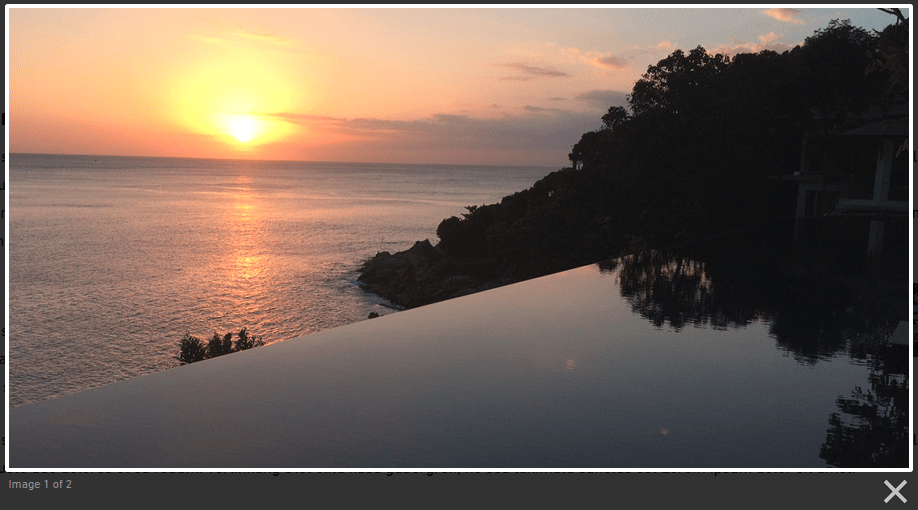
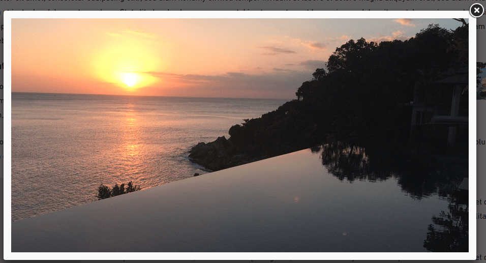
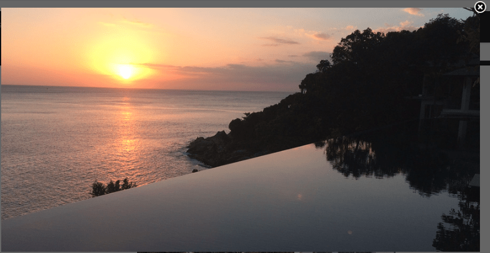
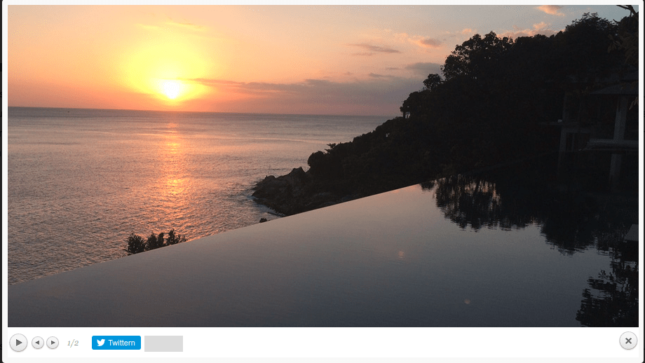


.. include:: ../Includes.txt

============
Introduction
============

ext:ns_all_lightbox
===================

.. figure:: Images/TYPO3_All_In_One_Lightbx_Modalbox_Extension_NITSAN_Banner_Preview.jpg
   :alt: TYPO3 EXT All_In_One_Lightbx Banner

.. _What-does-it-do:

What does it do?
================

One of the only TYPO3 extension which provides to use most popular jQuery Lightbox/Modalbox at TYPO3 content elements. This TYPO3 extension provides to configure many jQuery plugins eg., **lightbox2, fancybox2, colorbox, prettyphoto, darkbox, magnific-popup** & more will be available in an upcoming version.

.. _Screen-shots:

Screen Shots
================

**1. Lightbox**
------------------

`http://lokeshdhakar.com/projects/lightbox2/ <http://lokeshdhakar.com/projects/lightbox2/>`_

**2. Fancybox**
-------------------------

`http://fancyapps.com/fancybox/3/ <http://fancyapps.com/fancybox/3/>`_

**3. Colorbox**
--------------------

`http://www.jacklmoore.com/colorbox/ <http://www.jacklmoore.com/colorbox/>`_

.. figure:: Images/3-Screen-shot-Color-min.png
   :alt: screenshot "All_In_One_Lightbx Color"
   :class: with-shadow

**4. Darkbox**
--------------------

`https://github.com/pepelsbey/darkbox <https://github.com/pepelsbey/darkbox>`_

**5. Prettyphoto**
--------------------

`https://github.com/pepelsbey/darkbox <https://github.com/pepelsbey/darkbox>`_

**6. Magnific Popup**
--------------------

`http://dimsemenov.com/plugins/magnific-popup/ <http://dimsemenov.com/plugins/magnific-popup/>`_

.. figure:: Images/6-Screen-shot-Popup-min.png
   :alt: screenshot "All_In_One_Lightbx Magnific Popup"
   :class: with-shadow